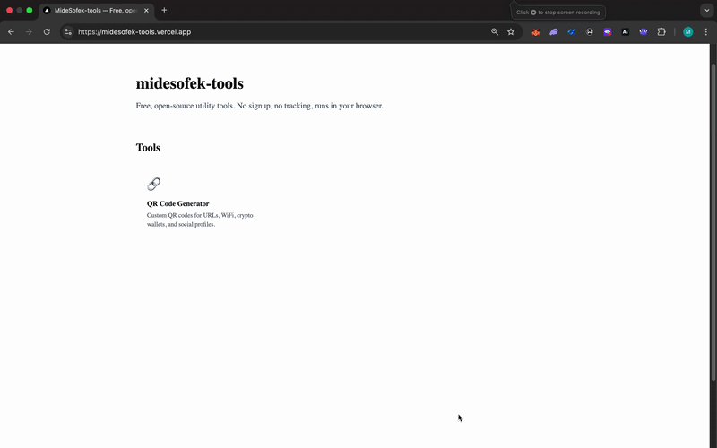

# MideSofek-Tools

**Free, open-source utility tools for builders, traders, and creators.**

[](https://opensource.org/licenses/MIT)
[](https://github.com/midesofek/midesofek-tools/actions/workflows/ci.yml)
[](https://nextjs.org/)

**Live at [midesofek-tools.vercel.app](https://midesofek-tools.vercel.app)**



---

## What do we have here?

A growing suite of free, open-source web tools. No signup, no tracking, no paywalls. Everything runs in your browser.

This is a single Next.js app — each tool lives at its own route (e.g. `/qr-code-generator`) and shares a common layout, design system, and SEO template.

## Tools

|     | Tool                                                                      | Status         |
| --- | ------------------------------------------------------------------------- | -------------- |
| 🔗  | [QR Code Generator](https://midesofek-tools.vercel.app/qr-code-generator) | ✅ Live        |
| ⛽  | Gas Fee Tracker                                                           | 🚧 Coming soon |
| 🔗  | URL Shortener                                                             | 🚧 Coming soon |
| 🧾  | Onchain Receipt Generator                                                 | 🚧 Coming soon |
| 🐳  | Solana Token Bundlers                                                     | 🚧 Coming soon |

## Tech stack

- **Framework:** [Next.js 14](https://nextjs.org/) (App Router)
- **Language:** TypeScript
- **Styling:** [Tailwind CSS](https://tailwindcss.com/) + [shadcn/ui](https://ui.shadcn.com/)
- **QR rendering:** [qr-code-styling](https://github.com/kozakdenys/qr-code-styling)
- **Analytics:** [Vercel Analytics](https://vercel.com/analytics) + Speed Insights
- **Deployment:** [Vercel](https://vercel.com)

## Run locally

```bash
git clone https://github.com/midesofek/midesofek-tools.git
cd midesofek-tools
npm install
npm run dev
```

Open [localhost:3000](http://localhost:3000).

## Project structure

midesofek-tools/
├── app/
│ ├── page.tsx # homepage with tool grid
│ ├── qr-code-generator/ # one folder per tool
│ │ ├── page.tsx # tool's SEO page
│ │ ├── QRGenerator.tsx # tool's UI
│ │ └──
│ ├── sitemap.ts # auto-generated from registry
│ └── robots.ts
├── components/
│ ├── layout/ # Nav, Footer
│ ├── tool-page/ # shared SEO template (hero, FAQ, etc.)
│ └── ui/ # shadcn primitives
├── content/tools/ # per-tool content (about, FAQ, history)
├── lib/
│ ├── tools.ts # SOURCE OF TRUTH for all tools
│ └── seo.ts # metadata helpers
└── docs/ # repo-only assets (screenshots, etc.)

## How to add a new tool

The registry in `lib/tools.ts` is the single source of truth. Adding a tool is done in 3 simple steps:

1. **Add an entry to `lib/tools.ts`** with the slug, name, description, and metadata.
2. **Create `app/[slug]/page.tsx`** following the QR generator pattern: load the tool from the registry, wrap with `ToolPageLayout`, plug in your tool component.
3. **Create `content/tools/[slug].ts`** with the about/features/FAQ data.

The homepage grid, sitemap, OG metadata, and cross-links update automatically.

## Contributing

PRs are welcome. See [CONTRIBUTING.md](./CONTRIBUTING.md) for more info on how to contribute.

## License

MIT — see [LICENSE](./LICENSE).

---

Built by [@midesofek](https://midesofek.com).
